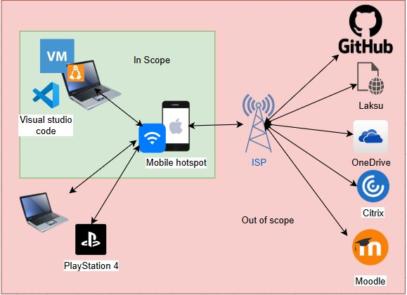
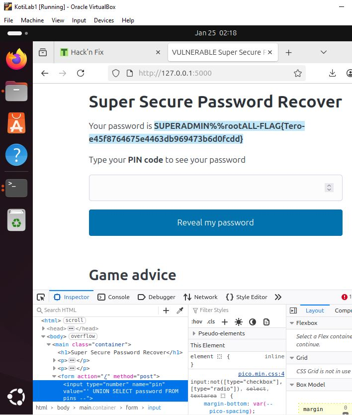
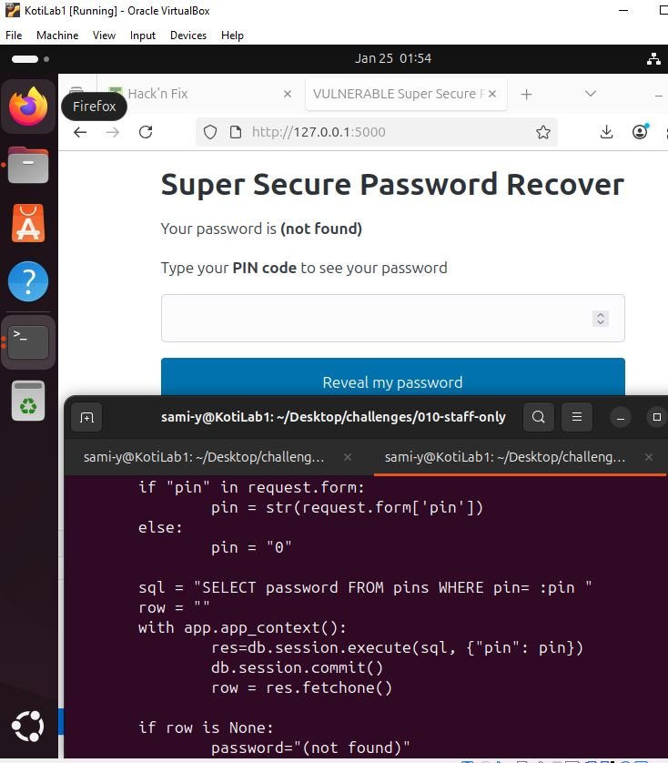
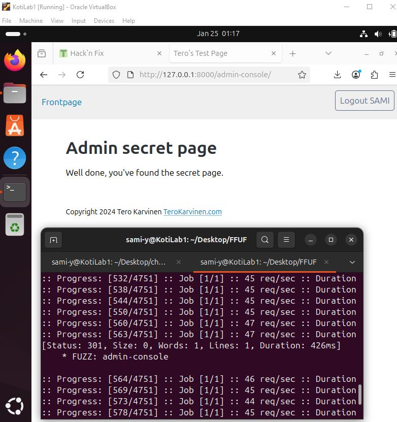
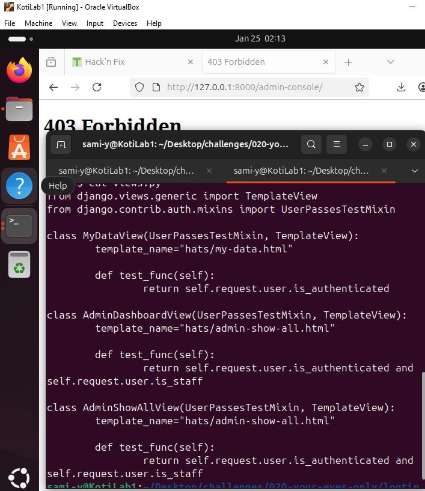

# Sovellusten-h-kk-ys
## h0
Nopea ohjelma joka kysyy nimeä ja tervehtii, käännettynä binääriksi.

LÄHDEKOODI:
```python
nimi=str(input("Kerro nimesi"))
print("Hello",nimi)
```

Ohjelma binäärinä binary viewer lisäosassa.


## h1 Kotiverkon ISMS soveltamisala
Osa kotiverkon laitteista kuuluu soveltamisalaan, koska niitä käytetään koulutehtävien tekoon. Muut laitteet ovat kohdeympäristön ulkopuolella, koska ne eivät ole oleellisia tehtävien kannalta. Osa tarpeellisista resursseista ovat täysin hallintani ulkopuolella ja rajaan ne siksi ulos. Muutamat resurssit ovat osittain vaikutukseni alaisia tai olen niiden käytöstä vastuussa ja siksi ne osittain kuuluvat soveltamisalaan.
Verkkoyhteys muodostuu puhelimesta, jolla jaetaan hotspot Wi-Fi yhteys muille laitteille. Laitteita verkossa: HP EliteBook 840 G2 (Ubuntu desktop virtuaalikone pyörii tällä koneella), HP Pavilion (Out of scope, koska sitä ei käytetä koulutehtäviin), PlayStation 4(Out of scope, koska sitä ei käytetä koulutehtäviin). 
Rajapintoja ovat Telia verkontarjoaja, OneDrive pilvitallenustila, GitHub tallenustila ja staattisen websivun isännöinti, Moodle kurssin verkkoalusta, Laksu tehtävien palautus verkkoalusta, Citrix koulun etätyöpöytä, Visual studio code koodieditori.



<table>
    <tr>
        <td>Kotiverkko</td>
        <td>Soveltamisala</td>
    </tr>
    <tr>
        <td>Wi-Fi, Mobiili hotspot, Iphone 12</td>
        <td>In scope</td>
    </tr>
    <tr>
        <td>Läppäri HP EliteBook 840 G2</td>
        <td>In scope</td>
    </tr>
    <tr>
        <td>Linux VM</td>
        <td>In scope</td>
    </tr>
    <tr>
        <td>Playstation 4</td>
        <td>Out of scope. Ei käytetä kurssilla.</td>
    </tr>
    <tr>
        <td>Läppäri HP Pavilion</td>
        <td>Out of scope. Ei käytetä kurssilla.</td>
    </tr>
    <tr>
        <td>Rajapinnat</td>
        <td></td>
    </tr>
    <tr>
        <td>Visual studio code</td>
        <td>In Scope</td>
    </tr>
    <tr>
        <td>Telia, Operaattorin verkko internetin puolella.</td>
        <td>Out of scope</td>
    </tr>
    <tr>
        <td>OneDrive. Pilvitallenustila</td>
        <td>Käyttö in scope. Alusta out of scope.</td>
    </tr>
    <tr>
        <td>GitHub. Repository ja page tehtävien palautukseen.</td>
        <td>Käyttö in scope. Alusta out of scope.</td>
    </tr>
    <tr>
        <td>Moodle. Kurssisivu</td>
        <td>Out of scope</td>
    </tr>
    <tr>
        <td>Laksu. Tehtävien palautuksen verkkopalvelu.</td>
        <td>Out of scope</td>
    </tr>
    <tr>
        <td>Citrix. Koulun etätyöpöytä</td>
        <td>Käyttö in scope. Alusta out of scope.</td>
    </tr>
</table>

Todisteet: 
Wi-Fi = Kuvankaappaus verkkoyhteyden ominaisuuksista. Laitteiden tiedot listattuna. Kuvakaappaus virtuaalikoneesta. Linkki GitHub repoon, kuvakaappaus OneDrive asetuksista.

<table>
    <tr>
        <td>Sidosryhmät</td>
        <td>Tarve / Vaatimus / Odotus</td>
        <td>ISO 27001 vaatimusalue</td>
        <td>Evidence</td>
    </tr>
    <tr>
        <td>Minä</td>
        <td>Tärkeiden tiedostojen ja järjestelmien suojaus sekä saatavuus. Tehtävien jatkuvuus. Confidentiality, Integrity, Availability</td>
        <td>ISO 27001 kokonaisuudessaan</td>
        <td>Soveltamisalan määrittäminen Tietoturva tavoitteiden ja toimien suunnitelma sekä toimeenpano. Auditointi ja dokumentaatio</td>
    </tr>
    <tr>
        <td>Operaattori</td>
        <td>Verkkoyhteyden sopimuksenmukainen käyttö. Security, Compliance</td>
        <td>Operation 8.1 toiminnan suunnittelu ja ohjaus.</td>
        <td>Toiminnan auditointi ja seurannan dokumentointi</td>
    </tr>
    <tr>
        <td>Viranomainen</td>
        <td>Lainsäädännön noudattaminen Henkilötietojen käsittely asianmukaisella tavalla. Privacy, Compliance</td>
        <td>Operation 8.1 &amp; Performance evaluation 9.1  Seuranta, mittaus, analysointi ja arviointi.</td>
        <td>Toiminnan auditointi ja seurannan dokumentointi</td>
    </tr>
</table>

Tehtävässä käytetty SFS-EN ISO/IEC 27001:2023 Tietoturvallisuus, kyberturvallisuus ja tietosuoja. Tietoturvallisuuden hallintajärjestelmät. Vaatimukset. Suomen Standardisoimisliitto SFS ry


## h2 Break & Unbreak

Tämä tehtävä tehtiin virtuaalikoneella: KotiLab1
OS = Ubuntu desktop amd(64-bit) version 24.04.3
vCore = 2 vCPU
vRAM = 3999 MB
vMemory = 25 GB
Network = NAT 

010 staff-only
HACKING it.
Web sivulla on yksi laatikko syötteelle, jonne asettaa pin. Kokeilin useammalla eri muodolla [' or 1=1 --],  [' +OR+1=1 ; -- ], [' OR 1=1 ;--]. Mikään ei mennyt palvelimelle asti, joten katsoin tehtävän neuvoja. Inspect työkalulla tarkastellen, syötteenä otetaan vain numeroita type="number". Samalla työkalulla voi poistaa syöte tyypin, ennen kuin lähettää lomakkeen palvelimelle. Nyt voin kirjoittaa mitä vain kenttään ja se menee palvelimelle. Sama injektio [' OR 1=1 --] uudestaan ja sain vastaukseski "foo". Yritin seuraavaksi saada tulosteena kaikki tietueet [' UNION SELECT * FROM pins OR 1=1 --] antoi error 500. Luovuin siitä ideasta ja kokeilin saada pelkän salasana tietueen [' UNION SELECT password FROM pins OR 1=1 --] sama error 500. Siitä toinen kokeilu [' UNION SELECT password FROM pins --] onnistui.


FIXIN it.
Haavoittuvuus koodissa oli SQL kyselyn ketjuttamista("concatenation of SQL queries"), eli käyttäjän syöte lisätään osaksi SQL lausetta. [SELECT FROM table WHERE row = "user input";] tyyppiset lauseet ovat haavoittuvia. Valmistellut lauseet joilla on parametriudut kyselyt on hyvä tapa estää SQL injektiot. OWASP Cheat Sheet Series, SQL Injection Prevention Cheat Sheet
https://cheatsheetseries.owasp.org/cheatsheets/SQL_Injection_Prevention_Cheat_Sheet.html
Korjattu koodi vaihtaa käyttäjä syötteen muuttujan pin arvoksi:
```sql = text("SELECT password FROM pins WHERE pin = :pin")

    row = ""

    with app.app_context():
        res = db.session.execute(sql, {"pin": pin})
        db.session.commit()
        row = res.fetchone()
```

Tällaisia haavoittuvuuksia voi ilmetä kohteissa joissa ei ymmärretä SQL injektio tekniikoita.


020 - Your Eyes Only
HACKING it.
Web-sivulla suoritin ensimmäisenä piilotettujen hakemistojen fuzzauksen, ffuf työkalulla käyttäen common.txt sanakirjaa yleisistä verkkopoluista. [./ffuf -w common.txt -u http://127.0.0.1:8000/FUZZ] oli hidas suorittaa, mutta yksi pyyntö onnistui ("admin-console"). On siis olemassa yksi piilotettu hakemisto. Sen syöttäminen url kenttään ei toiminut. Sivulla oli mahdollista kirjautua ja rekisteröityä käyttäjäksi, joten päätin kokeilla rekisteröityä ja sitten kirjautua sisään. Kokeilin uudelleen sisään kirjautuneena syöttää url kenttään /admin-console ja tämä toimi.


FIXIN it.
Ongelman löytäminen lähdekoodista oli haastavaa, joten katsoin opettajan neuvot läpi ja siellä sanottiin pääsynhallinta asioiden olevan views.py tiedostossa. Siellä oli ```class AdminShowAllView``` joka tarkisti vain käyttäjän olevan sisään kirjautunut. Ratkaisuna kopioin ylempää class AdminDashboardView, test_func funktion ```class AdminShowAllView``` test_func sisään. Tämä ratkaisi tilanteen.

Tällaista voi sattua huolimattomuudesta. Pääsyoikeuksien vertikaalinen eskalointi voi päästää hyökkääjän poistamaan tai muuttamaan tietoja järjestelmässä.


Tero Karvinen Hack'n Fix tehtävä ja neuvot
https://terokarvinen.com/hack-n-fix/

OWASP Top 10:2021 A01 – Broken Access Control https://owasp.org/Top10/A01_2021-Broken_Access_Control/

PortSwigger Web Security Academy Access control vulnerabilities and privilege escalation https://portswigger.net/web-security/access-control

OWASP Cheat Sheet Series, SQL Injection Prevention Cheat Sheet
https://cheatsheetseries.owasp.org/cheatsheets/SQL_Injection_Prevention_Cheat_Sheet.html

Tero Karvinen 2023 Find Hidden Web Directories - Fuzz URLs with ffuf https://terokarvinen.com/2023/fuzz-urls-find-hidden-directories/

Joona Hoikkala (joohoi) ffuf
https://github.com/ffuf/ffuf

Dictionary of common web paths by Daniel Miessler
https://github.com/danielmiessler/SecLists/blob/master/Discovery/Web-Content/common.txt
