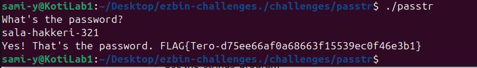
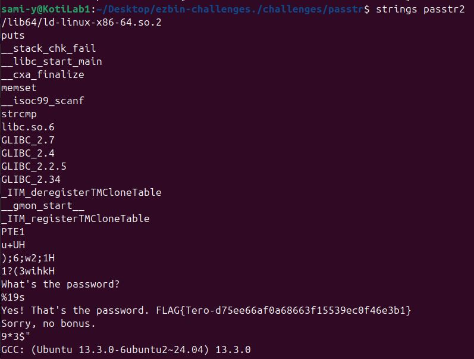
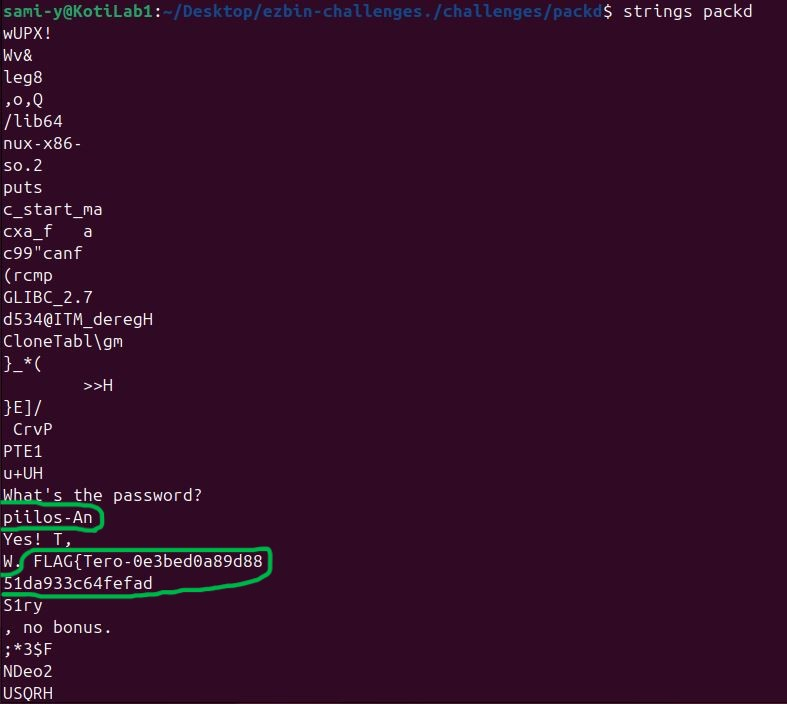
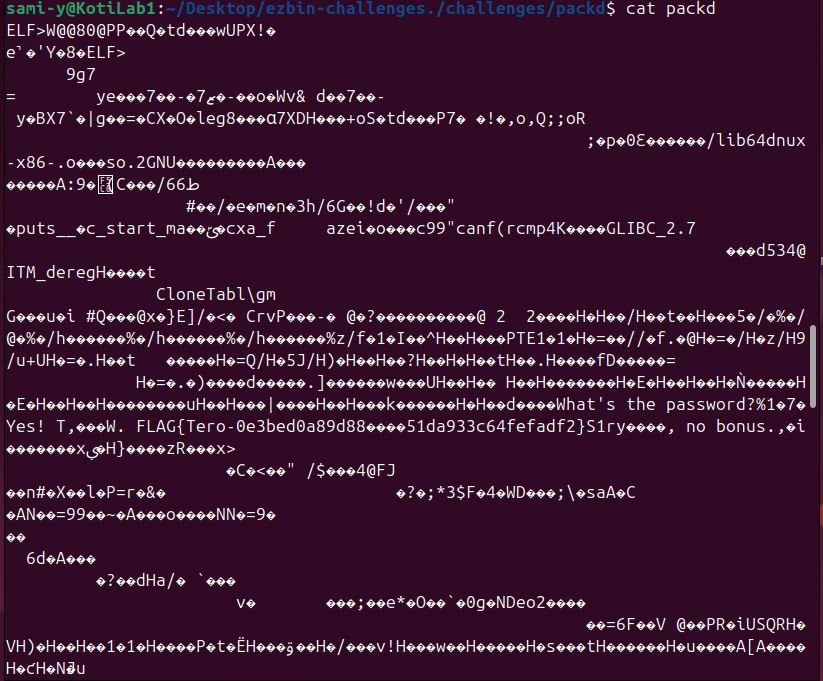
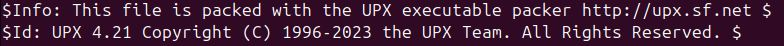
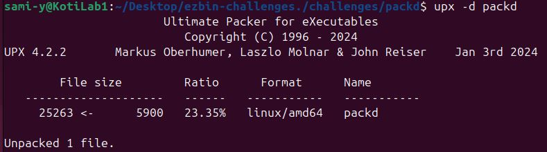
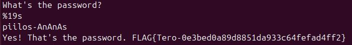

# H3
Tehtävän ohjeet ja vinkit([Tero Karvinen application hacking - 2026 Spring homework h3](https://terokarvinen.com/application-hacking/#laksyt))
# a) Strings. Löydä salasana ja lippu katsomatta lähdekoodia.
Tämä onnistui 'strings' komennolla. 
Latasin Kotilab1 virtuaalikoneelleni [ezbin-challenges.zip](https://terokarvinen.com/loota/yctjx7/ezbin-challenges.zip), josta "passtr" niminen ohjelma löytyy. Sitten tiedoston purku ja hakemistoon siirtyminen, jonka jälkeen katsotaan luettavia merkkijonoja binääristä komennolla:
```
strings passtr
```

.JPG)

Sieltä löytyi kaikennäköisiä tekstejä, mutta sala-hakkeri-321 ja FLAG pisti silmään. Joten päättelin lipun löytyneen ja testasin vielä salasanaa ohjelmassa.



```
Password: sala-hakkeri-321     FLAG{Tero-d75ee66af0a68663f15539ec0f46e3b1}
```

# b) Tee uusi versio passtr.c ohjelmasta, jossa salasana ei näy suoraan binääristä.
Tämä vaati, jonkin verran lukemista, koska C on minulle vielä vierasta. 
Löysin hyvän artikkelin tähän "Obfuscating strings" aiheeseen. [(yurisk.info string-obfuscating-in-C)](https://yurisk.info/2017/06/25/binary-obfuscation-string-obfuscating-in-C/) Tiivistettynä idea on siis kääntää merkkijonot ei luettaviksi lisäämällä tai poistamalla merkkeihin integer arvo ja säilyttää ne taulukossa. Kun ne käännetään takaisin luettavaksi, poistetaan tai lisätään se sama integer arvo. 


## Alkuperäinen lähdekoodi passtr
```
// passtr - a simple static analysis warm up exercise
// Copyright 2024 Tero Karvinen https://TeroKarvinen.com

#include <stdio.h>
#include <string.h>

int main() {
	char password[20];
	
	printf("What's the password?\n");
	scanf("%19s", password);
	if (0 == strcmp(password, "sala-hakkeri-321")) {
		printf("Yes! That's the password. FLAG{Tero-d75ee66af0a68663f15539ec0f46e3b1}\n");
	} else {
		printf("Sorry, no bonus.\n");
	}
	return 0;
}
```
Tiedoston muokkaamiseen micro tekstieditorilla ja kääntämiseen gcc:llä eli GNU compiler collection löytyi /passtr hakemistosta tiedostot, jossa oli komennot niiden käyttöön.


## Obfuscating versio lähdekoodista

```
#include <stdio.h>
#include <string.h>

#define K 0x5A // Tässä määrittelen lisättävän arvon

static void decode(char *s) {
	while (*s) {
		*s ^= K;
		s++;
	}
}  // Funktio decode purkaa salauksen poistamalla arvon

int main() {
	char password[20];
	char pw[] = {
		's'^K,'a'^K,'l'^K,'a'^K,'-'^K,'h'^K,'a'^K,'k'^K,
		'k'^K,'e'^K,'r'^K,'i'^K,'-'^K,'3'^K,'2'^K,'1'^K,'\0'
	}; // Tässä on taulukko jossa salasana säilytetään obfuskoituna
	
	printf("What's the password?\n");
	scanf("%19s", password);

	decode(pw);
	
	if (0 == strcmp(password, pw)) {
		printf("Yes! That's the password. FLAG{Tero-d75ee66af0a68663f15539ec0f46e3b1}\n");
	} else {
		printf("Sorry, no bonus.\n");
	}
	
	return 0;
}

```
Nyt salasana ei enää näy käyttämällä strings komentoa. Tarkistin tämän käyttämällä 'strings passtr2' komentoa:



# c) Aja ohjelma packd. Etsi salasana ja lippu. 
(packd löytyy [ezbin-challenges.zip](https://terokarvinen.com/loota/yctjx7/ezbin-challenges.zip))
Hypoteesi edellisen tehtävän luonteen perusteella: Ohjelman binäärissä on obfuskoitu salasana jotenkin.


## Ensimmäisenä katsoin ajamalla ohjelman, että mitä se tekee. 
Komento:
```
./packd
```
Se kysyy salasanaa ja antaa vastauksen jos se on väärin.


## Toisena halusin nähdä onko salasana luettavana merkkijonona binäärissä. 
Komento:
```
strings packd
```


Siellä näyttäisi olevan rikkonaisen näköinen lippu ja salasana piilos-An. Tämä salasana ei kuitenkaan toiminut sellaisenaan, mutta voisi yhtä hyvin olla osa salasanaa. Niinpä veikkaan, että salasana string on hajautettu pieninä osina eri kohtiin tiedostoa.


## Tulipa mieleen katsoa miltä ohjelman sisältö näyttää myös "cat" komennolla


Sieltä löytyi lippu kokonaisen näköisenä, mutta sen sisällä on ei luettavia merkkejä. Olen melko varma, että tiedostossa on käytetty jotain muuta obfuskointia merkkijonojen paloittelun ohella.


## Vinkit käyttöön
Tässä vaiheessa alkoi tunnit kulua raapiessa päätä, joten katsoin vinkit läpi. ([Tero Karvinen application-hacking laksyt h3](https://terokarvinen.com/application-hacking/#laksyt))
Tiedosto on pakattu jollain ohjelmalla!

Aikaisempi strings komento paljasti jo, että kyseessä oli upx packer. En vain tajunnut sitä heti.



## Tässä vaiheessa yritetään siis purkaa tiedosto ja katsoa mitä käy.
Ensin piti ladata upx.([UPX the Ultimate Packer for eXecutables](https://upx.github.io/))
Sitten piti perehtyä sen käyttöön, siinä auttoi jonkin verran ([astrah reverse-engineering-upx-packed-executalbe](https://astrah.medium.com/reverse-engineering-upx-packed-executable-d9ed7df2f72)). Sieltä löytyi esimerkkiä purkamisesta komennolla: 
```
upx -d <file-name>
```


Nyt tiedosto on taas purettu, niin vilkaistaan miltä merkkijonot näyttää nyt.


```
Password: piilos-AnAnAs         FLAG{Tero-0e3bed0a89d8851da933c64fefad4ff2}
```
## Johtopäätös
Salasana oli siis sen takia puoliksi näkyvillä, koska tiedosto oli pakattu. Tämä ilmeisesti muuttaa merkkijonoja.

## Lähteet
- https://terokarvinen.com/application-hacking/#laksyt
- https://terokarvinen.com/loota/yctjx7/ezbin-challenges.zip
- https://yurisk.info/2017/06/25/binary-obfuscation-string-obfuscating-in-C/
- https://upx.github.io/
- https://astrah.medium.com/reverse-engineering-upx-packed-executable-d9ed7df2f72
