# h4 Some Disassembly Required
Tehtävän ohjeet ja vinkit([Tero Karvinen application hacking - 2026 Spring homework h3](https://terokarvinen.com/application-hacking/#laksyt))

## Ympäristö
Nämä tehtävät tehtiin virtuaalikoneella: KotiLab1
- OS = Ubuntu desktop amd(64-bit) version 24.04.3
- vCore = 2 vCPU
- vRAM = 3999 MB
- vMemory = 25 GB
- Network = NAT
- Selain = Firefox

## x) Lue / Katso / Kuuntele ja tiivistä asiat.
 Eagle and Nancy 2020:
- Ghidra on NSA:n kehittämä ohjelmiston käänteiskehitys työkalupaketti, "SRE tool suite".
    - Suurimmat hyödyt siinä on ohjelmien analysointi ja niiden purkaminen sekä kääntäminen binääristä takaisin luettavaksi koodiksi.
([Chris Eagle and Kara Nance 2020: The Ghidra Book: 3. Meet Ghidra ](https://learning.oreilly.com/library/view/the-ghidra-book/9781098125684/xhtml/ch03.xhtml))

Hammond 2022:
([GHIDRA for Reverse Engineering (PicoCTF 2022 #42 'bbbloat') video by John Hammond](https://www.youtube.com/watch?v=oTD_ki86c9I))
- ltrace ja strace (**Linux**)
  - ltrace on työkalu, jolla voi seurata ohjelman tekemiä kirjasto kutsuja.
  - strace on työkalu, jolla voi seurata ohjelman tekemiä järjestelmä kutsuja.
- Ghidrassa avataan uusi projekti.
- Ghidrassa Code browser on työkalu jolla voidaan selata projektissa avattuja tiedostoja.
- Analysoitavan tiedoston tiedostotyypin ghidra tunnistaa ja pyrkii kääntämään C-kielelle.
- Code browser näyttää binäärissä olevia merkkijonoja, funktioita, muuttujia jne. ja niiden ristiviittauksia. Ghidra ei ilmeisesti osaa kääntää funktioiden nimiä, mutta antaa meidän muokata niitä itse.

Optional: € Eagle and Nancy 2020:
([Chris Eagle and Kara Nance 2020: The Ghidra Book: 2. Reversing And Disassembly Tools](https://learning.oreilly.com/library/view/the-ghidra-book/9781098125684/xhtml/ch02.xhtml#ch02lev29))
- File komento, pyrkii tunnistamaan tiedoston tyypin. 
    - Voi antaa myös vääriä tulkintoja.
- PE työkalut, pyrkii tunnistamaan mitä kääntäjiä ja muita työkaluja ohjelman rakentamiseen ollaan käytetty.
- Summary työkalut. Tutkii syvällisemmin kohdetiedostoja ja parsii tarkkaa dataa niistä.
- Deep inspection työkalut. Poimii tiettyä dataa riippumatta tiedostotyypistä.


## a) Ladataan Ghidra

Ohjeet uusimman version lataamiseen: ([Ghidran github sivu](https://github.com/NationalSecurityAgency/ghidra))
- Ghidra ladataan .zip tiedostossa. Uusin tällä hetkellä on ghidra_12.0.2_PUBLIC_20260129.zip
- Tarvitaan myös JDK 21 64bit. Sen voi ladata ([Adoptium Temurin JDK-21-LTS](https://adoptium.net/temurin/releases?version=21&os=any&arch=any))
- Tiedostot puretaan ja javan kirjasto jdk-21 kannattaa lisätä heti oikeaan tiedostopolkuun, jotta ghidra voi käyttää sitä. Tämä onnistuu seuraavilla komennoilla:
    Puretaan jdk:
    ```
      tar xvf <JDK distribution .tar.gz>
    ```
    Avataan bashrc nanolla:
    ```
    nano ~/.bashrc
    ```
    Lisätään jdk:n bin hakemisto PATH muuttujaan, lisäämällä seuraava bashrc tiedostoon:
    ```
    export PATH=<lisää tähän puretun JDK:n tiedostopolku>/bin:$PATH
    ```


    
## b) rever-C. Käännetään packd binääri C-kielelle. Etsitään main ohjelma ja sopivasti uudelleen nimetään muuttujat. Selitetään ohjelman toimintaa ja ratkaistaan tehtävä binääristä ilman lähdekoodia.
Avataan Ghidrassa uusi projekti h4, jonne siirrän packd tiedoston ezbin-challenges.zip kansiosta. Minulla on jo edeltävästä tehtävästä ([h3](https://github.com/SamiYli/Sovellusten-h-kk-ys/blob/1abeaff0a654193eecfc6acc8c3db1e5cab1959a/h3.md)) upx:llä purettu versio packd:stä, joten käytän sitä tässä tehtävässä.
### Import packd tiedosto.

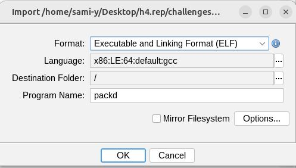


 ### Analysoidaan tiedosto Ghidrassa.

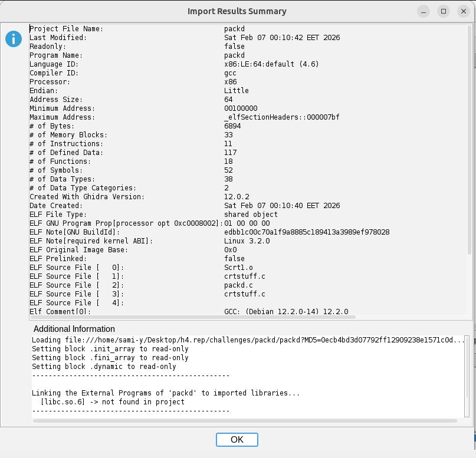

 
### Katsotaanpa löytyykö main niminen funktio, filter ominaisuudella.


Vautsi mitä koodia.
### Siinä se on kaikessa kauneudessaan. Decompile ikkunassa näen, että main funktiossa on nähtävillä kaksi muuttujaa:
```
iVar1
local_28
```
iVar1 on siis arvoltaan yhtäsuuri kuin string comparison local_28 & "piilos-AnAnAs". "piilos-AnAnAs" on melkovarmasti salasana. iVar1:stä verrataan ehtolauseessa vielä 0:lla, jonka seurauksena tulostuu vahvistusviesti ja lippu.
### Muutetaan vähän muuttujien nimiä selkeyttämään funktion toimintaa:

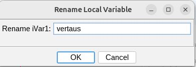 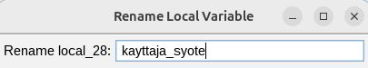 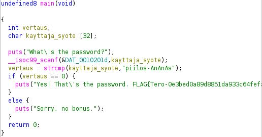

### Otetaan tiedosto ulos ja testataan.
packd_testille pitää määrittää vielä luvat ajaa ohjelmana. Tässä komento:
```
chmod u+x packd_testi
```

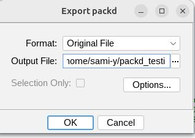 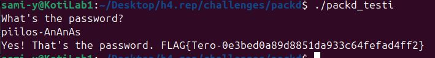

Toimii. Salasana oli main funktiossa.

## c) If backwards. Muutetaan passtr ohjelman binääriä siten, että se hyväksyy kaikki paitsi alkuperäisen salasanan. Testataan, että ohjelma toimii.
Import passtr
Analysoidaan passtr

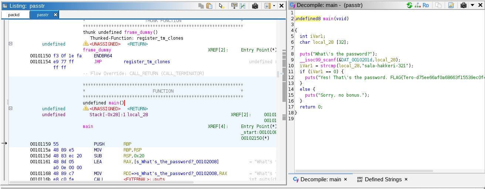

Main funktio löytyi

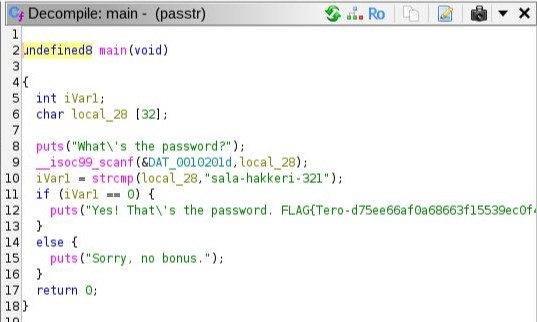

### logiikka on siis 
if iVar1 == 0 on se ehtolause joka päättää tulosteen.


Mä haluan muuttaa sen: iVar1 != 0, jotta tulosteet kääntyisivät päinvastoin.


Decompiler näkymässä koodin muuttaminen ei onnistunut. Puretun koodin vieminen ulkoiseen editoriin ei helpottanut, kun kokeilin sain vain pitkän listan virheviestejä.
Etsiskelin vähän artikkeleita netistä ja löysin yhden, jossa selitettiin assembler kieltä ja binäärin paikkaamista.([Vickie Li 2020: Patching Binaries](https://materials.rangeforce.com/tutorial/2020/04/12/Patching-Binaries/)). Binäärin paikkaus("Binary patching") on siis ohjelman prosessi-virran ja binäärin muokkaamisen prosessi.

### Muutetaan siis ohjelman suoritusta binary patching menetelmällä. 
Pistetään ohjelma hyppäämään päinvastaiseen tulosteeseen.

Decompiler näkymässä napsauttamalla if-ehtolauseesta, listing ikkunassa korostuu se sama kohta assembly ohjeina.

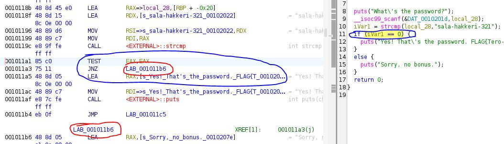

Ohjelma hyppää tulosteeseen "sorry, no bonus" kun vertailun tulos on muuta kuin nolla. Vaihdetaan patch instruction työkalulla kohta jnz - Jump if not equal/nonzero, kirjoitetaan tilalle jz - Jump if equal/zero. Sitten suorituksessa vertailun tuloksella 0 hypätään tulostukseen "sorry, no bonus".

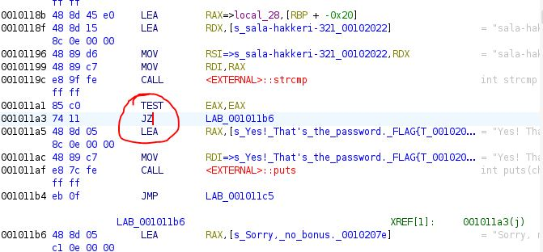

### Viedään sitten tiedosto testattavaksi:
File - Export program - jne.

Annoin ohjelman kopiolle nimeksi "rtssap2".

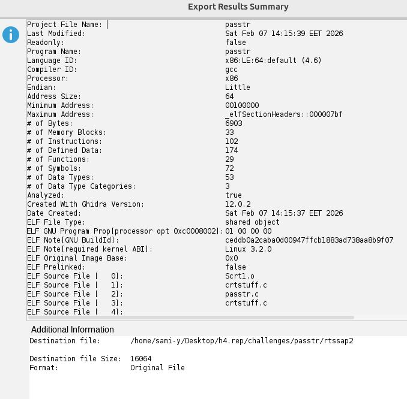

### Testi

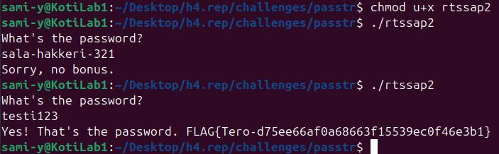

## d) Nora CrackMe: Käännä binääriksi Tindall 2023: NoraCodes/ crackmes. Lue README.md: älä katso lähdekoodia. 
Tehtävässä tarvittavat tiedostot löytyy täältä: ([NoraCodes/ crackems](https://github.com/NoraCodes/crackmes))
Ensin lataan tehtävät ja sitten käännän binääriksi:
```
gcc -o <output-file-name> <file-name>
```
Noran dokumentaatiossa mainitaan toinenkin komento jolla kääntää binääriksi:
```
make <file-name>
```
Siitä tulee .64 päättyinen tiedosto. Testasin tätä kohdassa f).

## e) Nora crackme01. Solve the binary.
Muutetaan binääriksi. Katsotaan mitä ohjelma tekee, kun sen suorittaa.

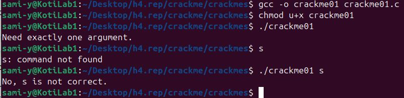

### Analysoidaan Ghidralla

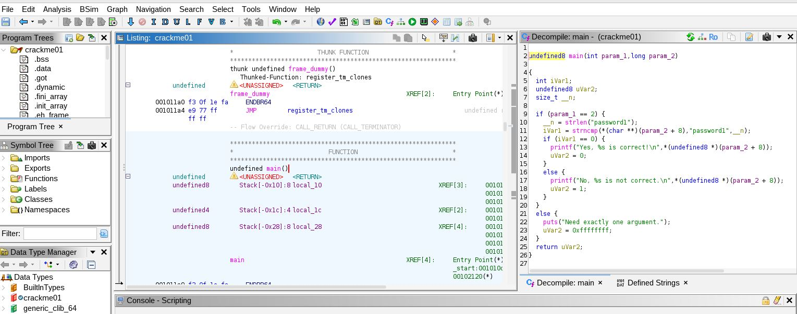

### Salasana näyttäisi olevan merkkijonona binäärissä.


### Testataan salasanaa 

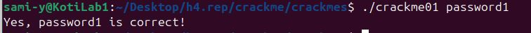


## e) Nora crackme01e. Solve the binary.
### Analysoidaan Ghidralla

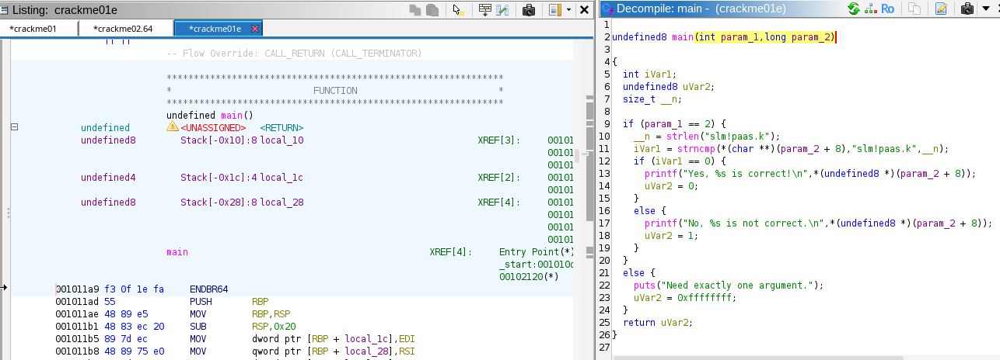

### Salasana näyttäisi olevan merkkijonona binäärissä.
Testataan sitä.

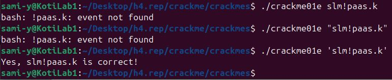


## f) Nora crackme02. Name the main program's variables from the reverse-engineered binary and explain the program's operation. Solve the binary. LISÄTTY (23.2.2026)

### Analysoidaan ghidralla crackme02

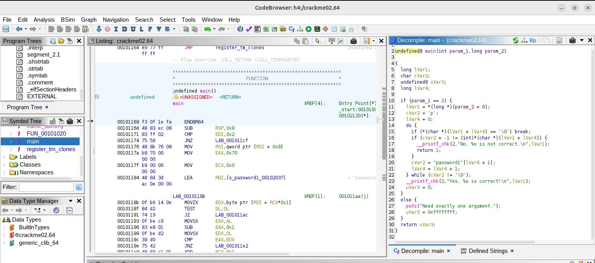

### Ohjelmassa on neljä eri muuttujaa. Aloitan ohjelman tarkastelun seuraamalla miten muuttujia käytetään main-funktion suorituksessa ja koitan nimetä niitä paremmin.

- Assembly ohjeissa (cVar2) siirretään rekisteriin EAX. En tiedä miksi, mutta sinne se menee. Annan nimeksi "yksi-merkki?", koska se on char muuttuja jolla on arvo 'p'.

  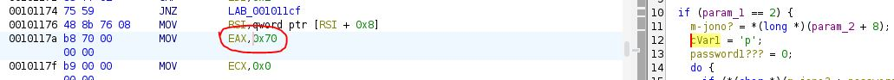

- Assembly ohjeissa merkkijono?(lVar1) siirretään osoitteeseen RSI. Luulen, että tämä on käyttäjän syöte. Nimeän sen "m-jono?"

  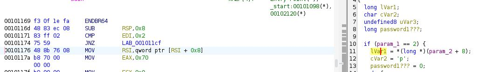

- Assembly ohjeissa (lVar4) siirretään RDI rekisteriin. Oletan, että tämä on salasana, koska niin lukee assembly listauksessa. 
  Nimeän "password1", mutta se oli hankalan oloinen niin uudelleen nimesin myöhemmin "salasana".

  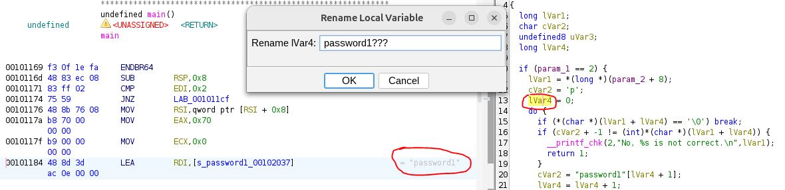

- Viimeinen muuttuja (uVar3) esiintyy 'return' kohdassa, joten oletan sen olevan paluu-viesti "No %s is not correct." 

### Tältä näyttää nyt uudelleen nimetyt muuttujat main funktiossa
Alkaa olla vähän selkämpi lukuinen.

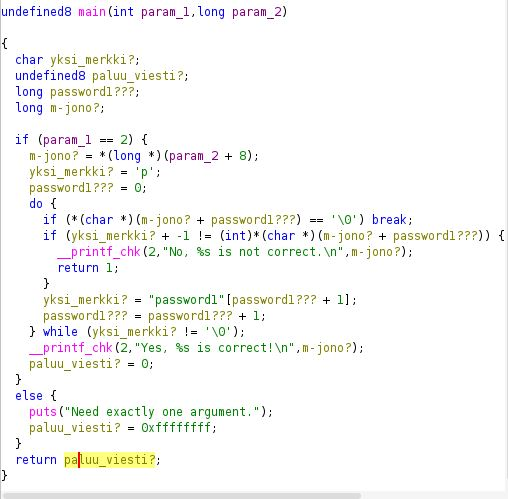

### Ohjelman suoritus menee siis 
- IF-loop, jossa vertaillaan salasanaa ja merkkijonoa

  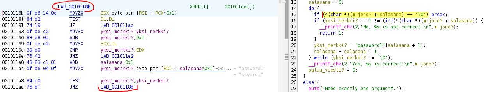
  
- Jos ehto täyttyy, niin loop rikkoutuu ja suoritus hyppää tänne.

  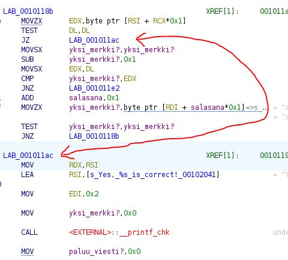
  
- Jos if-ehto ei täyty, niin ohjelma menee tänne.

  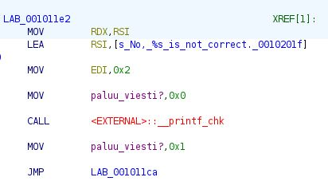

### Katsotaan decompiler näkymää tarkemmin
- Jos "param_1 == 2" niin tarkistus if-loop alkaa, muuten tulostuu virhe viesti ja ohjelma alkaa alusta.
- IF-loop alussa
  ```
  if (m-jono? + salasana == '\0') break;   \\ Salasanan ja merkkijonon on oltava 0, jotta loop murtuu.
  ```
- Assemblyssä "break" kohdassa on test, jonka jälkeen JZ.

  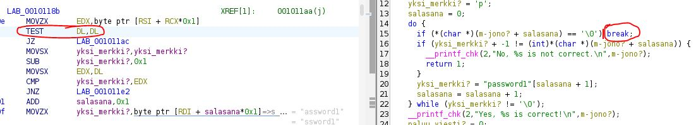
  
- Seuraava kohta IF-loopissa on toinen if-lause, mutta en löydä JZ kohtaa klikkailemalla decompiler näkymässä mitään.

  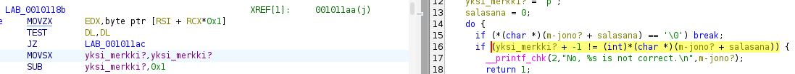

### Voisiko olla, että salasana on arvoltaan 0?

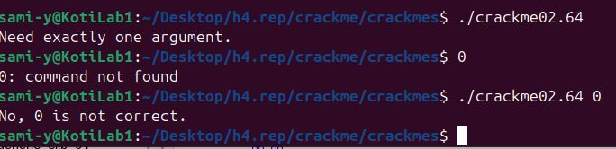

Ei ollut.

Kysyin chatgpt:ltä, mitä "\0" tarkoittaa? Ja sain vastaukseksi:
```
\0 on:
 Nollatavu (arvo 0)
 Käytetään merkkijonon lopettamiseen
 Ei tulostu näkyvänä merkkinä
 Eri asia kuin merkki '0'
```
Sainpa siitä idean kokeilla sql-injektiosta tuttua tyhjää tulostusta ''.

### Kokeillaan ' '


Toimii!!
