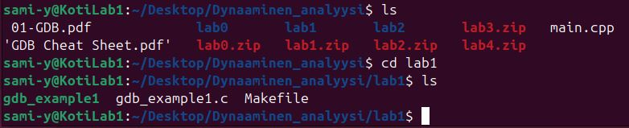
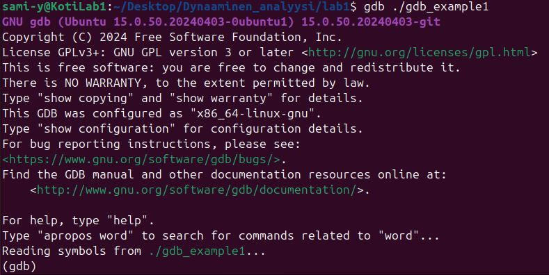
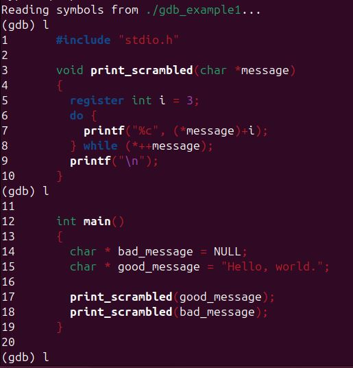
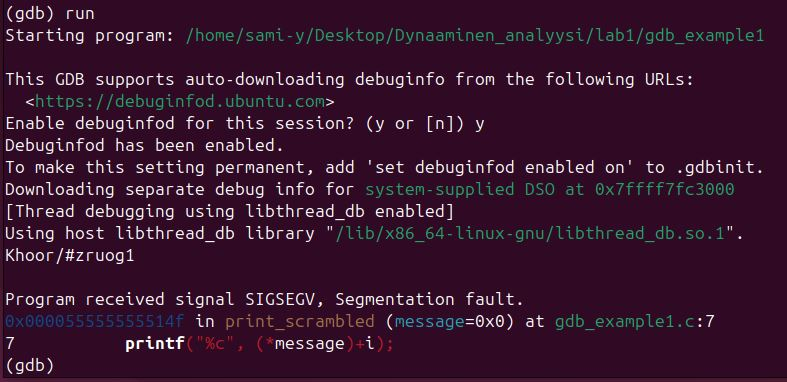
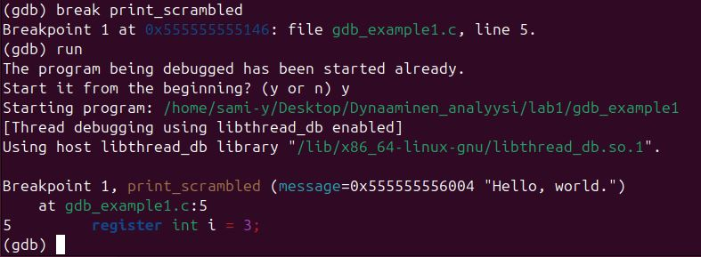

# H5 It's Alive!
 Tehtävä ja ohjeet: [h5 It's Alive! (Lari)](https://terokarvinen.com/application-hacking/#laksyt)
 ## LAB1
 Tutki ohjelmaa ja tapoja korjata se.

 ### Ensimmäisenä purin lab1.zip. 
 Sen sisältä löytyy ohjelma gdb-example1 ja sen lähdekoodi tiedosto sekä "Makefile" niminen gcc-ohjetiedosto.

 

 ### Seuraavaksi katson gnu-debuggerilla gdb-example1 ohjelmaa.

 
 

 Listataan ohjelman koodia komennolla:
 ```
l
 ```



Tässä on siis ohjelma, joka tulostaa funktiossa print_scrambled merkkijonon arvoja, joihin se lisää arvon 3. Funktio print_scrambled saa merkkijonon arvot funktiossa main, määritellyistä muuttujista.

### Ajamalla ohjelman sain virhe viestin SIGSEGV segmentation fault.
Ohjelma ajetaan debuggerissa komennolla:
 ```
run
 ```



Segmentation fault viittaa tilanteeseen, jossa ohjelma yrittää käyttää sille kuulumatonta muistia.

Kokeilen asettaa keskeytyspisteen ohjelman suoritukseen ennen vikatilannetta. Jatkaa siitä kunnes löydän kohdan, joka aiheuttaa ongelman.
Breakpoint eli keskeytyspiste asetetaan komennolla:
 ```
break <kohta johon asetetaan>
 ```




### Jatketaan ohjelmaa
