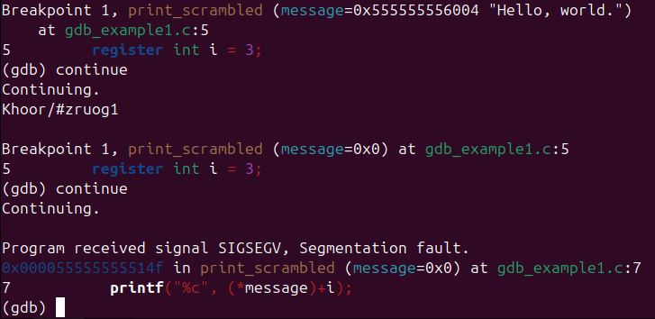
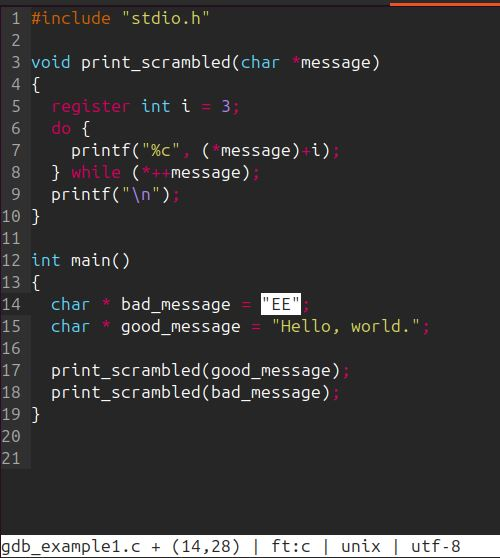
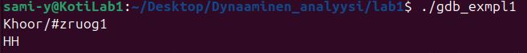
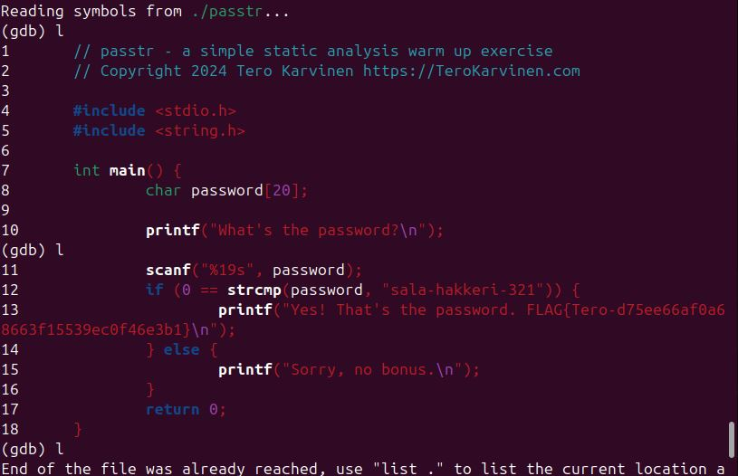
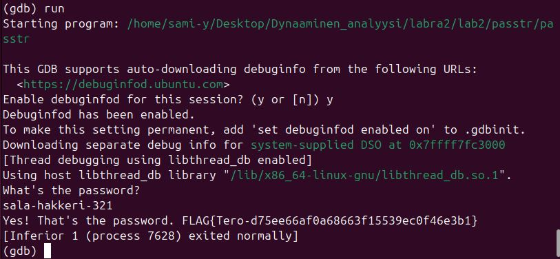

# H5 It's Alive!
 Tehtävä ja ohjeet: [h5 It's Alive! (Lari)](https://terokarvinen.com/application-hacking/#laksyt)
 ## LAB1
 Tutki ohjelmaa ja tapoja korjata se.

 ### Ensimmäisenä purin lab1.zip. 
 Sen sisältä löytyy ohjelma gdb-example1 ja sen lähdekoodi tiedosto sekä "Makefile" niminen gcc-ohjetiedosto.

 

 ### Seuraavaksi katson gnu-debuggerilla gdb-example1 ohjelmaa.

 
 

 Listataan ohjelman koodia komennolla:
 ```
l
 ```


Tässä on siis ohjelma, joka tulostaa funktiossa print_scrambled merkkijonon arvoja, joihin se lisää arvon 3. Funktio print_scrambled saa merkkijonon arvot funktiossa main, määritellyistä muuttujista.

### Ajamalla ohjelman sain virhe viestin SIGSEGV segmentation fault.
Ohjelma ajetaan debuggerissa komennolla:
 ```
run
 ```


Segmentation fault viittaa tilanteeseen, jossa ohjelma yrittää käyttää sille kuulumatonta muistia. [Alex Allain: Debugging Segmentation Faults and Pointer Problems](https://www.cprogramming.com/debugging/segfaults.html)

Kokeilen asettaa keskeytyspisteen ohjelman suoritukseen ennen vikatilannetta. Jatkaa siitä kunnes löydän kohdan, joka aiheuttaa ongelman.
Breakpoint eli keskeytyspiste asetetaan komennolla:
 ```
break <kohta johon asetetaan>
 ```


### Jatketaan ohjelmaa
Komento:
 ```
continue
 ```



Nyt siis print_scrambled (message=0x0) jälkeen saadaan vikaviesti. Tässä siis tapahtuu virhe. NULL-pointer dereference. Osoitetaan muistiin mitä ohjelma ei voi käyttää.

### Miten ratkaisen?
En ymmärrä miksi ohjelmalla haluttaisiin tulostaa yhtään mitään "Hello, world." lisäksi, jos toinen tuloste on "bad_message" muuttuja. Koska en jaksa pähkäillä enempää, muutan "bad_message" muuttujan arvoksi "EE". Ohjelma sitten oletettavasti toimisi, kun ei osoitella tyhjyyteen.

### Tehdään ohjelmasta testiversio ja muutetaan microlla.
Kopioin ohjelman lähdekoodin ja muutaan sitä micro koodieditorissa.



Käännetään binääriksi komennolla:
```
gcc -g -Wall -o
```
### Testataan muokattua ohjelma


### Ei virheviestejä, joten se toimii.

# LAB2
Etsitään salasana ja lippu.


Samalla tavalla kuin lab1 puretaan lab2.zip ja sieltä löytyy "passtr" & "passtr2o" ohjelmat sekä "passtr.c" , "Makefile" ja "README.md".


### a) Katsotaan debuggerilla passtr ohjelmaa



Siinä näemme nyt ohjelman koodin ja siellä näyttäisi olevan luettavana merkkijonona salasana johon verrataan käyttäjän syötettä. 

### Kokeillaan ajaa ohjelma ja käyttää salasanaa.



### Toimi

### b) passtr2o
Tästä ohjelmasta ei ole lähdekoodia, joten gdb:llä ei pysty tarkastelemaan sitä.
Tämä on niin vaikea, että voi kestää tovi löytää vastaus. Palaan tähän vielä.

