# H6 Hardware hacking
ohjeet kurssin moodle sivuilla (2026p3 - Sovellusten hakkerointi ja haavoittuvuudet - ICI012AS3A-3003 - Tero ja Lari - Hardware hacking)

Tasks:
 1. decrypt firmware image
 2. Analyse the image file
 3. extract rootfs from the dump file
 4. extract rootfs from the image file
 5. search available applications
 6. analyse and try to open root password


## 1. firmware image dekryptaaminen

Tarvitsin AWS CLI:n ladatakseni TapoV3 firmware binäärin. Sen lataaminen onnistui näillä ohjeilla. [aws documentation - installing latest version of aws cli](https://docs.aws.amazon.com/cli/latest/userguide/getting-started-install.html)

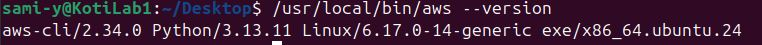

Tämän jälkeen moodle sivuilta löytyvällä lataus komennolla: 
```
aws s3 cp s3://download.tplinkcloud.com/firmware/Tapo_C200v3_en_1.4.2_Build_250313_Rel.40499n_up_boot-signed_1747894968535.bin Tapo_C200v4_en_1.4.2.bin --no-sign-request
```
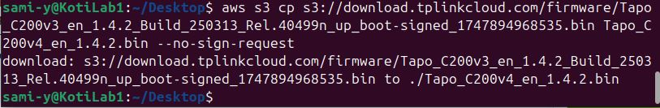

-------------------------------------------------------------------------------------------------

### Ohjeet tp-link-decrypt käyttöön löytyy github sivulta [README.md](https://github.com/robbins/tp-link-decrypt/blob/ef7430e653bc301d7f98c92714ac99bec91c93af/README.md):
```
1.  (optional)  Run ./preinstall.sh or nix-shell to satisfy dependencies   \\Lataa tarvittavia työkaluja ohjelman suoritukseen openssl, binwalk etc.
```
```
2.  Run ./extract_keys.sh  to extract RSA/DES keys from TP-Link Firmware we download from vendor   \\Lataa firmwaren ja poimii siitä RSA/DES-avaimet
```
  Suorituksen jälkeen näyttää tältä:

  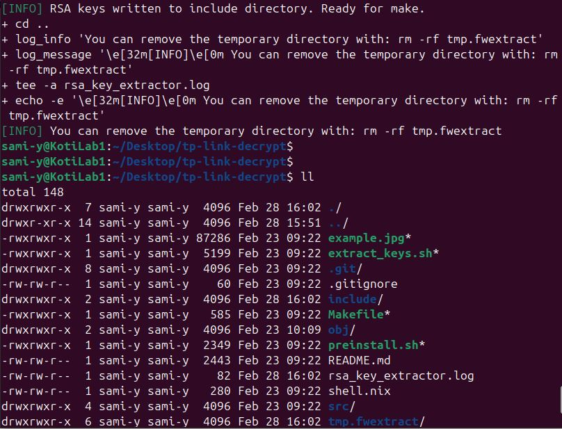
  
```
3.  Run make    \\Kääntää ohjelmaksi
```
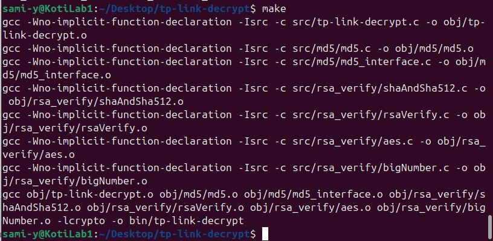


```
Decrypt with   bin/tp-link-decrypt <fw file>    \\Ohjelmaa ajetaan tällä komennolla.
```

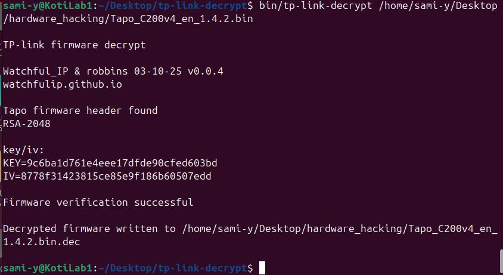

-------------------------------------------------------------------------------------------------

## 2. Analysoidaan dekryptattu tiedosto

Kysyin ChatGPT-4:ltä hyviä tapoja analysoida ja se ehdotti binwalkia.
```
binwalk Tapo_C200v4_en_1.4.2.bin.dec
```
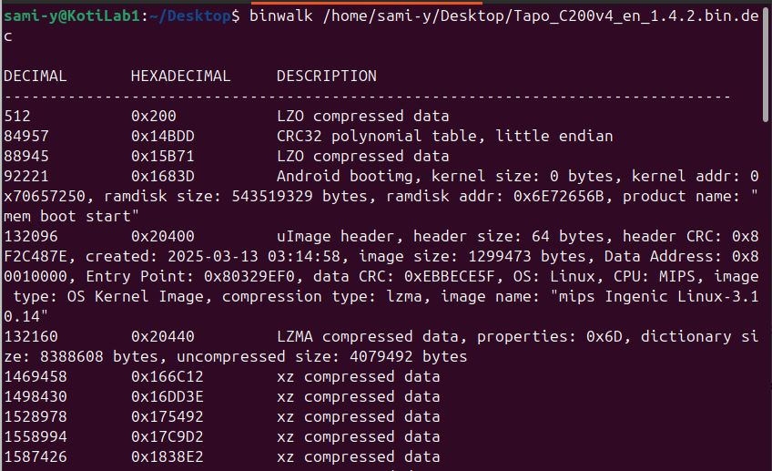

Ensin on jotain LZO pakattua dataa, tauluja ja järjestelmä sekä header tietoja. Sitten tulee pakattuja xz lohkoja monta riviä.

Lopussa tulee kuitenkin tieto, että kyseessä on squashfs filesystem.
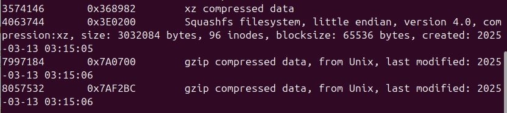

-------------------------------------------------------------------------------------------------
## 3. Otetaan rootfs dump-tiedostosta. 
(dump-tapo_C200v4_en_1.4.2.bin) on ladattavissa moodle sivulla.

```
binwalk dump-tapo_C200v4_en_1.4.2.bin
```
Tämäkin on squash tiedostojärjestelmä.

Irroitetaan käyttämällä dd-komentoa siitä mistä sen tiedostorakenne alkaa:
```
dd if=dump-tapo_C200v3_en_1.4.2.bin of=rootfs bs=1 skip=4456448 count=3032084
```
Puretaan komennolla:
```
unsquashfs rootfs
```
Lopputuloksena saadaan tämä:

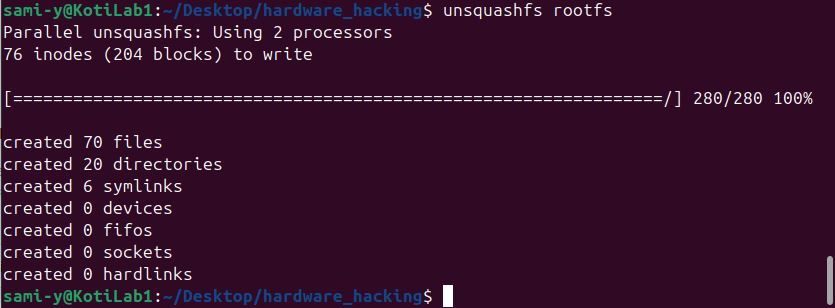

-------------------------------------------------------------------------------------------------
## 4. Tehdään sama dekryptatulle image-tiedostolle.
squashfs alkaa kohdasta 4063744
ja sen koko on 3032084 tavua.
```
dd if=Tapo_C200v4_en_1.4.2.bin.dec of=rootfs_image bs=1 skip=4063744 count=3032084
```
Puretaan taas komennolla:
```
unsquashfs rootfs_image
```
Näyttää tältä
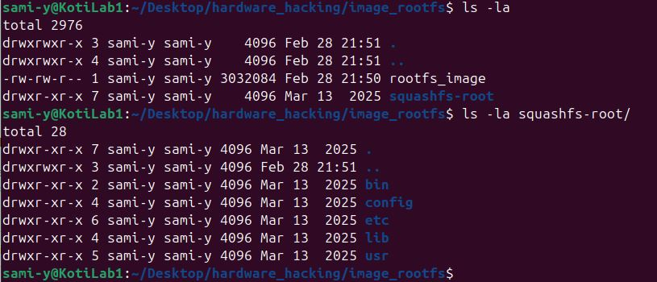

-------------------------------------------------------------------------------------------------
## 5. Etsitään sovelluksia
Ensin rootfs_image squashfs-root/bin

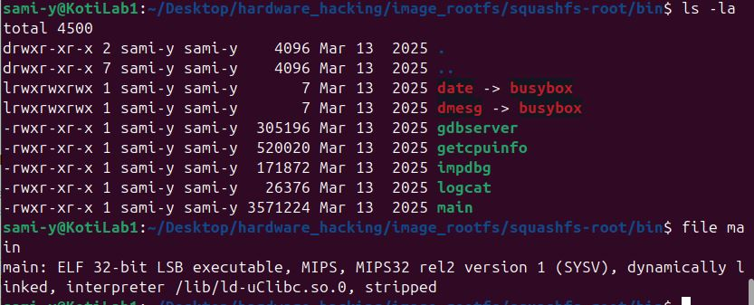


Sitten dump_rootfs

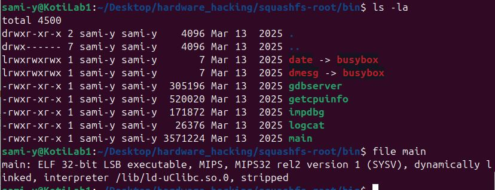

-------------------------------------------------------------------------------------------------
## 6 En ehtinyt päästä tässä alkuun. Katsotaan ensitunnilla ratkaisu.

-------------------------------------------------------------------------------------------------

### Lähteet
[qkaiser • Jul 25, 2025 - Rooting the TP-Link Tapo C200 Rev.5](https://quentinkaiser.be/security/2025/07/25/rooting-tapo-c200/)

[robbins - tp-link-decrypt](https://github.com/robbins/tp-link-decrypt)
