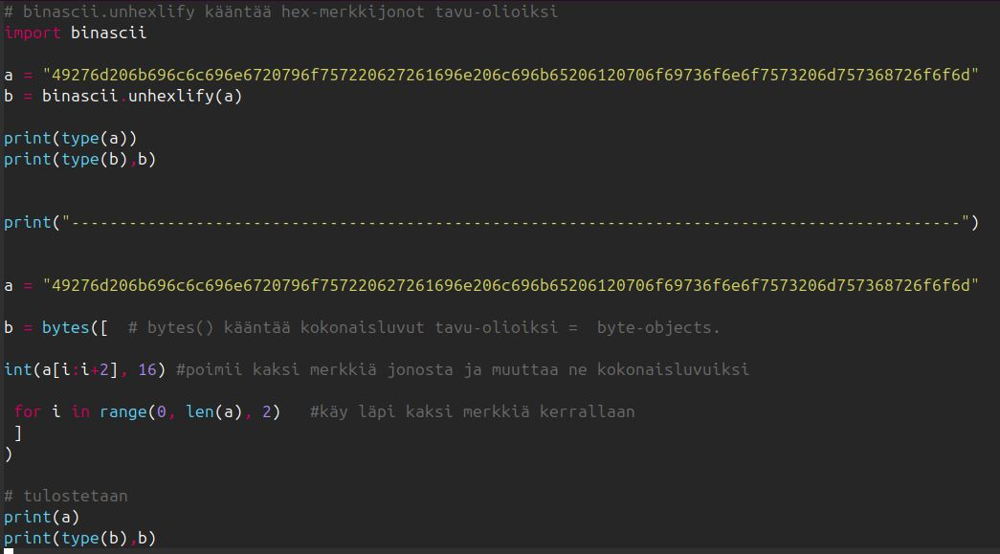
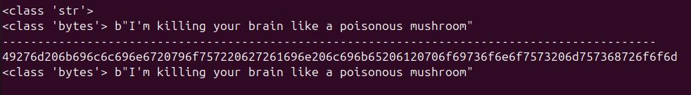
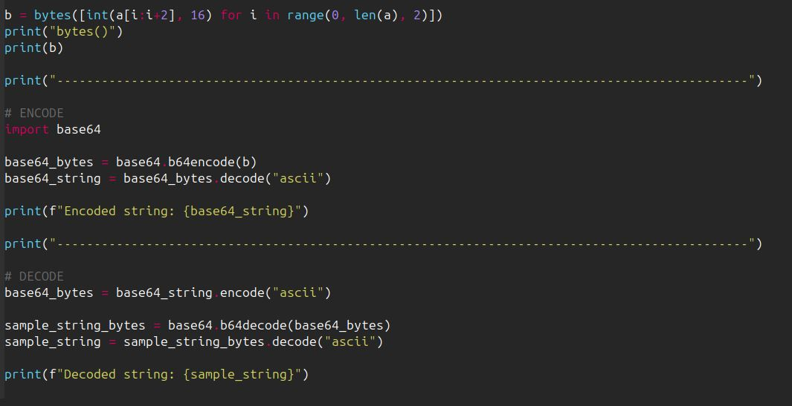
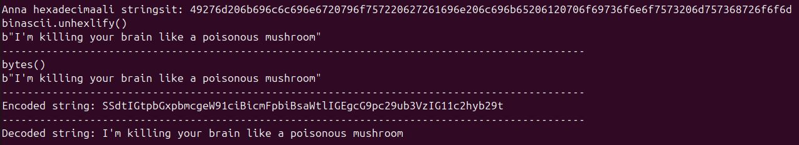
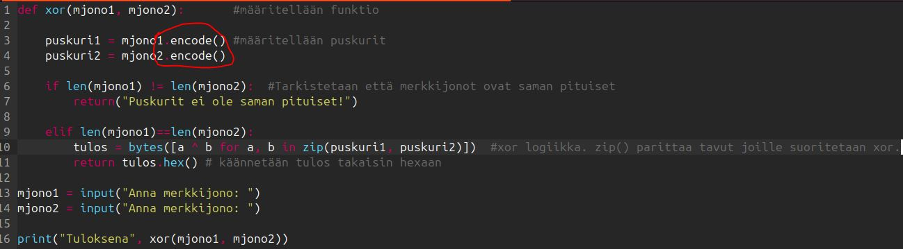
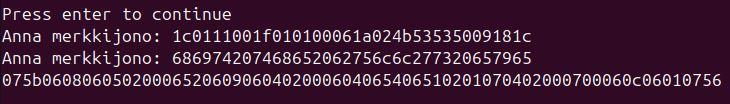
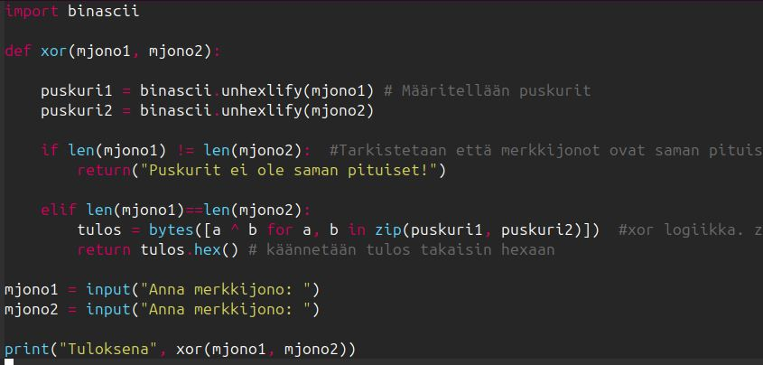
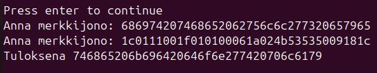

# h7 Uhagre2

## x) Read/watch/listen and summarize.

[Schneier 2015: Applied Cryptography, 20ed: Chapter 1: Foundations:](https://www.oreilly.com/library/view/applied-cryptography-protocols/9781119096726/08_chap01.html#chap01-sec001)
1.1 Terminology ("Historical Terms" to the end)
  - Lähettäjä ja vastaanottaja: tarkoittaa juuri miltä kuullostaakin.
  - Viesti ja salaus( encrypt ): viesti on luettavaa tekstiä ja salaus on prosessi, joka pyrkii estämään sen lukemista.
  - salauksen purku ( decrypt ): salauksen peruuttamisen prosessi, joka pyrkii kääntämään viestin taas luettavaksi.
  - Authentication: Viestin vastaanottajan on pystyttävä todentamaan viestin alkuperä.
  - Integrity: Vastaanottajan pitää pystyä varmentamaan viestin eheys.
  - Nonrepudiation: Lähettäjä ei voi myöhemmin kiistää lähettäneensä viestin.
 
  - cipher: matemaattinen funktio, joka suorittaa tai purkaa salauksen
  - restricted algorithm: algoritmin turvallisuus perustuu sen toiminnan salaamiseen.
  - key: mikä tahansa suuri luku, jota käytetään salauksessa tai sen purkamisessa.
  - keyspace: avaimen( key ) mahdollisuuksien arvo-skaala.
  - 
  - symmetric algorithms: algoritmit, joissa salaus-avain on sama kuin purkamisen-avain.
  - stream cipher: algoritmi käsittelee yhtä bittiä tai tavua kerrallaan.
  - block cipher: algorimti käsittelee yhtä lohkoa (esim. 64-bits) kerrallaan.
  -
  - asymmetric algorithms ( publick-key algorithm ): salaus-avain on eri kuin purkamis-avain.
  - public-key: Julkinen salausavain. Salauksen purkaminen tapahtuu eri avaimella, joten salaukseen käytetty avain voi olla julkinen.
  - private-key: Yksityinen purkamis-avain.
  - 
1.4 Simple XOR
1.7 Large Numbers

Teron neuvot pythonin alkeisiin. [Karvinen 2024: Python Basics for Hackers](https://terokarvinen.com/python-for-hackers/)
- Aloitetaan pienestä ja listään siihen.
- REPL
- python3 ipython
- F5 compile, micro, runit
- python on hyvä laskin
- tulostus ja merkkijonot
- for loopit
- obfuskointi
- väitösten tarkistus: "assert"
- debugaaminen
- pysähdyspisteet pythonissa
- data-tyypit
- listan järjestämiset: "sort"
- kirjastot


Optional: Karvinen 2024: Get Started Micro Editor
Optional: Karvinen 2024: Getting Started with Cryptopals using Python
  But not the hints hidden under "click to expand"; those should only be looked at when needed. Some won't need them at all.


## a) 1. Convert hex to base64.
[cryptopals 1. convert hex to base64](https://cryptopals.com/sets/1)
Yritetään siis ottaa hexadesimaali muotoinen merkkijono ja muuttaa se base64 enkoodatuksi.

### Tehdään python ohjelma tätä varten
Aloitin kokeilemaan kahta eri tapaa kääntää hexaa tavu-olioiksi:
- binascii.unhexlify()
- bytes()

> [!NOTE]
> bytes() kokeilussa halusin käydä aina kaksimerkkiä kerrallaan, koska yksi tavu on 8-bittiä ja yksi hexa merkki on 4-bittiä.





Tein ohjelmaan vielä parit muutokset, että saan tulosteessa:
```
SSdtIGtpbGxpbmcgeW91ciBicmFpbiBsaWtlIGEgcG9pc29ub3VzIG11c2hyb29t
```





## b) 2. Fixed XOR.
Tehdään funktio, joka ottaa kaksi samanpituista puskuria ja tuottaa niiden XOR yhdistelmän.

Edellisestä tehtävästä jäi käteen, miten saadaan koodattua hexaa tavuiksi. Nyt piti tehdä funktio, joka koodaa hexa merkkijonot tavuiksi, suorittaa xor:ia kahdelle puskurille ja tarkistaa puskureiden pituuden. 





Ensimmäisellä yrityksellä lopputulos ei aivan ollut mitä piti. En muista ajatusta, joka minut johti käyttämään encode(). Vaihdoin sen binascii.unhexlify() ja se alkoi toimia. Ilmeisesti ensimmäisen yrityksen ongelma oli, että encode() muutta vain merkit tavuiksi ascii koodin mukaan.





## c) 3. Single-byte XOR cipher.
Ohjeessa oli että ei saisi kirjoittaa koodia tekemään tätä minun puolesta, mutta aion silti kirjoittaa koodia.
Lähdin miettimään tätä sellaisella idealla, että ensin hex -> byte muunnos, sitten kokeillaan kaikkia ascii merkkejä xor:auksessa, sitten saadaan tulosteita, joista jokin on luettava viesti.

# En päässyt kovin pitkälle, Katsotaan uudestaan paremmalla aikaa.

## d) 4. Detect single-character XOR.
        Solving this task usually brings joy.
